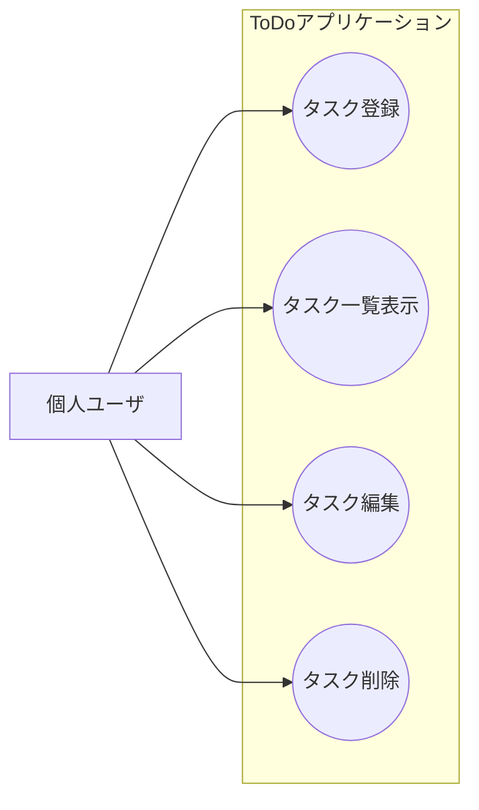

# 簡易ToDoアプリケーション要件定義書

## 1. 目的
本アプリケーションは，本番作成するデスクトップアプリケーションに向けた勉強として作成することを目的としている．
本アプリケーションは，ToDoを簡単に登録・管理するためのデスクトップアプリケーションである．
Webブラウザに依存せず，ローカル環境で安定して動作する．

## 2. 前提/技術スタック
### 2.1 アプリケーションの形態
[1] デスクトップアプリケーション

[2] フロントエンドとバックエンドを分離した構成

### 2.2 技術構成
[1] フロントエンド: React

[2] バックエンド: Java

[3] フロントとバックはローカルで通信

## 3. 対象ユーザ
[1] 個人ユーザ

[2] PCでタスク管理したい人

[3] OSやスキルを問わない

## 4. システム概要
[1] フロントエンド(React)
    1. 画面表示およびユーザ操作を担当

[2] バックエンド(Java)
    1. タスクデータの管理および永続化を担当

[3] データはローカル環境に保存

## 5. 機能要件
ユースケース図を以下に示す．

### 5.1 タスク管理機能
#### 5.1.1 タスク登録
[1] ユーザは新しいタスクを登録可能

[2] 登録項目は以下の表とする

| No. | 項目名    | 必須  | 内容 |
|:---|:---|:---|:---|
| 1 | タスクID  | 自動  | 一意に識別するID   |
| 2 | タスク名  | 必須  | タスクの名称          |
| 3 | メモ      | 任意  | タスク詳細説明        |
| 4 | 期限日  | 任意  | 完了期限              |
| 5 | ステータス    | 必須  | 未完了/完了   |

#### 5.1.2 タスク一覧表示
[1] 登録されたタスクを一覧で表示する

[2] 表示内容
    1. タスク名
    2. 期限日
    3. ステータス(完了/未完了)

[3] 完了タスクは未完了タスクと視覚的に区別する

#### 5.1.3 タスク編集
[1] 既存タスクの情報を編集可能

[2] 編集可能項目
    1. タスク名
    2. メモ
    3. 期限日
    4. ステータス

#### 5.1.4 タスク削除
[1] 任意のタスクを削除可能

[2] 削除には確認ダイアログを表示

## 6. 画面要件
### 6.1 画面一覧
| No. | 画面名 | 概要 |
|:---|:---|:---|
| 1 | タスク一覧画面 | タスクの表示・完了切り替え |
| 2 | タスク登録/編集画面 | タスク情報の入力・編集 |

### 6.2 UI要件
[1] シンプルで直感的な操作が可能

[2] マウス操作を基本とし，主要操作は最小ステップで完結

## 7. 非機能要件
### 7.1 性能要件
[1] タスク操作時における体感的な遅延が発生しないこと

[2] 少量〜中量(数百件程度)のタスク管理を想定

### 7.2 保守性
[1] フロントエンドとバックエンドは疎結合とする

[2] API仕様を明確に分離

### 7.3 可用性
[1] ネットワーク接続がなくても動作可能

## 8. データ要件
### 8.1 データ保存
[1] タスクデータはローカルに永続化

[2] アプリ終了後もデータは保存されている

### 8.2 データ整合性
[1] 不正なデータ(空タスク名等)は登録不可

## 9. 制約条件
[1] ユーザ認証機能は対象外

[2] マルチユーザ対応は実施しない

[3] クラウド同期機能は対象外
